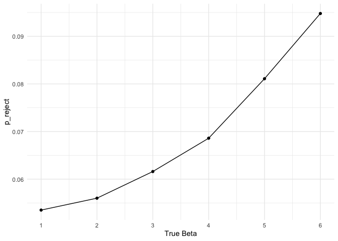

P8105 Homework 5
================
Xinyu Yang
11/8/2019

## Problem 1

``` r
#introducing missing value:
library(tidyverse)
```

    ## ── Attaching packages ────────────────────────── tidyverse 1.2.1 ──

    ## ✔ ggplot2 3.2.1     ✔ purrr   0.3.2
    ## ✔ tibble  2.1.3     ✔ dplyr   0.8.3
    ## ✔ tidyr   1.0.0     ✔ stringr 1.4.0
    ## ✔ readr   1.3.1     ✔ forcats 0.4.0

    ## ── Conflicts ───────────────────────────── tidyverse_conflicts() ──
    ## ✖ dplyr::filter() masks stats::filter()
    ## ✖ dplyr::lag()    masks stats::lag()

``` r
set.seed(10)

iris_with_missing = iris %>% 
  map_df(~replace(.x, sample(1:150, 20), NA)) %>%
  mutate(Species = as.character(Species))
```

Function and Map:

``` r
replace_iris_missing = function(x) {
  y = is.numeric(x) & is.na(x)
  z = is.character(x) & is.na(x)
  ifelse(y, round(mean(x, na.rm = TRUE),1), ifelse(z, "virginica", x))
}

#map the above function to vector-column in the dataset
map(.x = as.list(iris_with_missing), ~replace_iris_missing(.x))
```

    ## $Sepal.Length
    ##   [1] 5.1 4.9 4.7 4.6 5.0 5.4 5.8 5.0 4.4 4.9 5.4 4.8 5.8 4.3 5.8 5.7 5.4
    ##  [18] 5.1 5.7 5.1 5.4 5.1 4.6 5.8 4.8 5.0 5.0 5.2 5.8 4.7 4.8 5.4 5.2 5.5
    ##  [35] 4.9 5.0 5.5 4.9 4.4 5.1 5.0 4.5 4.4 5.0 5.1 4.8 5.1 4.6 5.3 5.0 7.0
    ##  [52] 6.4 6.9 5.5 6.5 5.7 6.3 4.9 6.6 5.2 5.0 5.9 6.0 6.1 5.6 6.7 5.6 5.8
    ##  [69] 6.2 5.6 5.9 5.8 6.3 5.8 6.4 6.6 6.8 6.7 6.0 5.7 5.5 5.8 5.8 6.0 5.4
    ##  [86] 5.8 6.7 5.8 5.6 5.5 5.5 5.8 5.8 5.0 5.8 5.7 5.7 6.2 5.1 5.7 6.3 5.8
    ## [103] 7.1 6.3 6.5 7.6 4.9 7.3 6.7 5.8 6.5 5.8 6.8 5.7 5.8 6.4 6.5 7.7 7.7
    ## [120] 6.0 5.8 5.6 7.7 6.3 6.7 7.2 6.2 6.1 6.4 7.2 7.4 7.9 6.4 5.8 6.1 5.8
    ## [137] 5.8 6.4 6.0 6.9 6.7 6.9 5.8 6.8 6.7 6.7 6.3 6.5 5.8 5.9
    ## 
    ## $Sepal.Width
    ##   [1] 3.5 3.0 3.2 3.1 3.6 3.9 3.4 3.4 2.9 3.1 3.1 3.4 3.1 3.0 4.0 4.4 3.9
    ##  [18] 3.5 3.8 3.8 3.4 3.7 3.6 3.3 3.4 3.0 3.4 3.5 3.4 3.2 3.1 3.1 3.1 4.2
    ##  [35] 3.1 3.2 3.5 3.6 3.0 3.4 3.5 3.1 3.2 3.5 3.8 3.0 3.8 3.2 3.7 3.1 3.1
    ##  [52] 3.2 3.1 2.3 2.8 2.8 3.3 2.4 2.9 2.7 2.0 3.0 2.2 2.9 2.9 3.1 3.0 3.1
    ##  [69] 2.2 2.5 3.2 2.8 2.5 2.8 2.9 3.0 2.8 3.1 3.1 2.6 2.4 2.4 2.7 2.7 3.0
    ##  [86] 3.4 3.1 3.1 3.0 2.5 3.1 3.1 3.1 2.3 2.7 3.0 2.9 2.9 2.5 2.8 3.1 2.7
    ## [103] 3.0 2.9 3.1 3.0 2.5 2.9 3.1 3.6 3.2 2.7 3.0 3.1 2.8 3.2 3.0 3.8 2.6
    ## [120] 2.2 3.2 3.1 2.8 2.7 3.3 3.2 2.8 3.0 2.8 3.0 2.8 3.8 2.8 2.8 3.1 3.0
    ## [137] 3.4 3.1 3.0 3.1 3.1 3.1 2.7 3.2 3.3 3.0 2.5 3.0 3.4 3.0
    ## 
    ## $Petal.Length
    ##   [1] 1.4 1.4 1.3 1.5 1.4 1.7 1.4 1.5 1.4 3.8 1.5 1.6 1.4 3.8 3.8 1.5 1.3
    ##  [18] 1.4 1.7 1.5 1.7 1.5 1.0 3.8 1.9 3.8 1.6 1.5 1.4 1.6 3.8 1.5 1.5 1.4
    ##  [35] 3.8 1.2 1.3 1.4 1.3 1.5 1.3 1.3 1.3 1.6 1.9 1.4 1.6 3.8 1.5 1.4 4.7
    ##  [52] 4.5 4.9 4.0 4.6 4.5 4.7 3.8 4.6 3.9 3.8 4.2 4.0 4.7 3.6 4.4 4.5 4.1
    ##  [69] 4.5 3.9 4.8 4.0 4.9 3.8 4.3 4.4 4.8 5.0 4.5 3.5 3.8 3.7 3.9 5.1 4.5
    ##  [86] 4.5 4.7 4.4 3.8 4.0 4.4 4.6 4.0 3.3 4.2 4.2 4.2 4.3 3.0 4.1 3.8 5.1
    ## [103] 5.9 5.6 5.8 6.6 4.5 6.3 3.8 3.8 5.1 5.3 5.5 5.0 5.1 5.3 3.8 6.7 6.9
    ## [120] 5.0 5.7 4.9 6.7 4.9 5.7 6.0 4.8 4.9 5.6 5.8 6.1 3.8 3.8 5.1 5.6 6.1
    ## [137] 5.6 5.5 4.8 5.4 5.6 5.1 5.1 3.8 3.8 5.2 5.0 5.2 5.4 5.1
    ## 
    ## $Petal.Width
    ##   [1] 0.2 0.2 0.2 1.2 0.2 0.4 0.3 0.2 0.2 0.1 0.2 0.2 0.1 0.1 0.2 0.4 0.4
    ##  [18] 1.2 0.3 1.2 0.2 0.4 0.2 0.5 0.2 0.2 0.4 0.2 0.2 0.2 0.2 0.4 0.1 0.2
    ##  [35] 0.2 0.2 0.2 0.1 1.2 0.2 0.3 1.2 0.2 0.6 0.4 0.3 0.2 0.2 0.2 0.2 1.4
    ##  [52] 1.5 1.5 1.3 1.5 1.3 1.6 1.0 1.3 1.4 1.0 1.5 1.2 1.4 1.3 1.4 1.5 1.0
    ##  [69] 1.5 1.1 1.8 1.3 1.5 1.2 1.3 1.4 1.4 1.2 1.2 1.0 1.1 1.0 1.2 1.6 1.5
    ##  [86] 1.6 1.2 1.3 1.2 1.2 1.2 1.2 1.2 1.2 1.3 1.2 1.3 1.3 1.2 1.3 2.5 1.9
    ## [103] 2.1 1.8 2.2 2.1 1.7 1.8 1.8 2.5 2.0 1.9 2.1 2.0 2.4 2.3 1.8 1.2 2.3
    ## [120] 1.5 1.2 2.0 2.0 1.8 2.1 1.8 1.8 1.8 2.1 1.6 1.2 2.0 2.2 1.5 1.4 2.3
    ## [137] 1.2 1.2 1.8 2.1 2.4 2.3 1.9 2.3 2.5 2.3 1.9 2.0 2.3 1.8
    ## 
    ## $Species
    ##   [1] "setosa"     "setosa"     "setosa"     "setosa"     "setosa"    
    ##   [6] "setosa"     "setosa"     "setosa"     "setosa"     "setosa"    
    ##  [11] "setosa"     "setosa"     "setosa"     "setosa"     "setosa"    
    ##  [16] "setosa"     "setosa"     "setosa"     "setosa"     "setosa"    
    ##  [21] "setosa"     "virginica"  "setosa"     "setosa"     "virginica" 
    ##  [26] "setosa"     "virginica"  "setosa"     "setosa"     "setosa"    
    ##  [31] "setosa"     "setosa"     "setosa"     "setosa"     "setosa"    
    ##  [36] "setosa"     "setosa"     "setosa"     "setosa"     "setosa"    
    ##  [41] "setosa"     "virginica"  "setosa"     "setosa"     "setosa"    
    ##  [46] "virginica"  "setosa"     "setosa"     "setosa"     "setosa"    
    ##  [51] "virginica"  "versicolor" "versicolor" "versicolor" "versicolor"
    ##  [56] "versicolor" "virginica"  "versicolor" "virginica"  "versicolor"
    ##  [61] "versicolor" "versicolor" "versicolor" "versicolor" "versicolor"
    ##  [66] "versicolor" "versicolor" "versicolor" "versicolor" "versicolor"
    ##  [71] "versicolor" "virginica"  "versicolor" "versicolor" "versicolor"
    ##  [76] "versicolor" "versicolor" "versicolor" "versicolor" "virginica" 
    ##  [81] "versicolor" "versicolor" "versicolor" "versicolor" "versicolor"
    ##  [86] "versicolor" "versicolor" "versicolor" "versicolor" "versicolor"
    ##  [91] "versicolor" "versicolor" "versicolor" "virginica"  "versicolor"
    ##  [96] "versicolor" "versicolor" "versicolor" "versicolor" "virginica" 
    ## [101] "virginica"  "virginica"  "virginica"  "virginica"  "virginica" 
    ## [106] "virginica"  "virginica"  "virginica"  "virginica"  "virginica" 
    ## [111] "virginica"  "virginica"  "virginica"  "virginica"  "virginica" 
    ## [116] "virginica"  "virginica"  "virginica"  "virginica"  "virginica" 
    ## [121] "virginica"  "virginica"  "virginica"  "virginica"  "virginica" 
    ## [126] "virginica"  "virginica"  "virginica"  "virginica"  "virginica" 
    ## [131] "virginica"  "virginica"  "virginica"  "virginica"  "virginica" 
    ## [136] "virginica"  "virginica"  "virginica"  "virginica"  "virginica" 
    ## [141] "virginica"  "virginica"  "virginica"  "virginica"  "virginica" 
    ## [146] "virginica"  "virginica"  "virginica"  "virginica"  "virginica"

## Problem 2

``` r
file_names <- list.files("./data")
read_in = function(x) {
  read_csv("./data/x") 
}
```

``` r
setwd("./data")
study <-
  file_names %>% 
  set_names() %>% 
  map_dfr(read_csv, .id = "source") %>% 
  separate(source, c("arm","id","a"), sep = "([\\.\\_])") %>% 
  select(id, arm, week_1:week_8) %>% 
  pivot_longer(week_1:week_8, names_to = "week", values_to = "obs_value")

library(viridis)

study %>% 
  separate(week, c("a", "week"), sep = "_") %>% 
  select(-a) %>% 
  ggplot(aes(x = week, y = obs_value, group = id, color = arm)) +
  geom_path() + 
  labs(title = "spaghetti plot of observations on each subject over time") + 
  viridis::scale_color_viridis(
    discrete = TRUE) + 
  theme(legend.position = "right")
```

<!-- -->

From the plot we can see ….. (comment the plot)

## Problem 3

``` r
sim_regression = function(beta1) {
  
  sim_data = tibble(
    x = rnorm(30, mean = 1, sd = 1),
    y = 2 + beta1 * x + rnorm(30, 0, 50)
  )
  
  lm(y ~ x, data = sim_data) %>% 
    broom::tidy() %>% 
    filter(term == "x") %>% 
    select(estimate, p.value) %>% 
    janitor::clean_names()
}

sim_results = 
  tibble(beta_true = c(1:6)) %>% 
  mutate(
    output_lists = map(.x = beta_true, ~rerun(10000, sim_regression(beta1 = .x))),
    estimate_dfs = map(output_lists, bind_rows)) %>% 
  select(-output_lists) %>% 
  unnest(estimate_dfs)

#plot1
sim_results %>% 
  mutate(
    reject = ifelse(p_value < 0.05, 1, 0)
  ) %>% 
  group_by(beta_true) %>% 
  summarise(
    n = n(), 
    a = sum(reject)) %>% 
  mutate(p_reject = a/n) %>% 
  ggplot(aes(x = beta_true, y = p_reject)) +
  geom_point() +
  geom_line() +
  scale_x_continuous("True Beta", breaks = c(1:6)) 
```

<!-- -->

From the plot of proportion of reject the null and true beta, we can
see…

``` r
#plot2
df_1 <-
  sim_results %>% 
  group_by(beta_true) %>% 
  summarise(all = mean(estimate)) 
df_2 <-
sim_results %>% 
  filter(p_value < 0.05) %>% 
  group_by(beta_true) %>% 
  summarise(reject = mean(estimate))
df_1 %>% 
  inner_join(df_2, by = "beta_true") %>%  
  group_by(beta_true) %>% 
  pivot_longer(all:reject, names_to = "estimate", values_to = "value") %>% 
  ggplot(aes(x = beta_true, y = value, label = round(value,1))) +
  geom_line(aes(color = estimate)) +
  geom_text(vjust = 0, nudge_y = 0.8, aes(color = estimate)) +
  scale_x_continuous("True Beta", breaks = c(1:6))
```

<!-- -->

From the plot above, we can see
